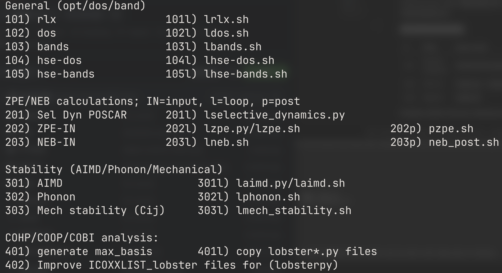

# Vaspworks

A single entry point for VaspWorks is vasp_inp.sh. Run `vasp_inp.sh` and pick a numbered option.

```bash
git clone https://github.com/mukesh4iitb/VaspWorks.git
export PATH=$PATH:/path/of/VaspWorks
# run vasp_inp.sh and select numbered option.
vasp_inp.sh
```

## Menu reference



### Notation
| Symbols/Abbreviation | Meaning |
|---|---|
| `IN` | input-generation step (ZPE/NEB group) |
| `l` | **loop** script — drives/automates the calculation to completion |
| `p` | **post** script — post-processes the finished run |


